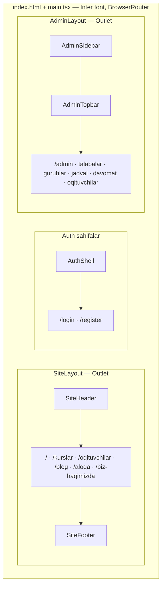
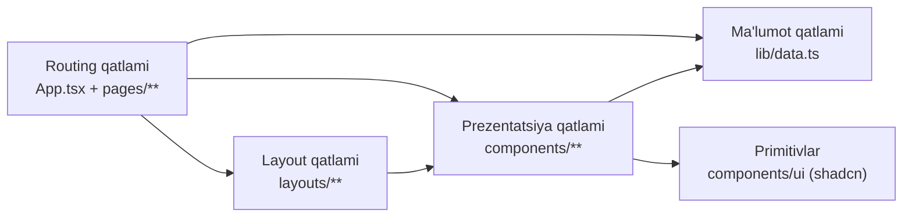
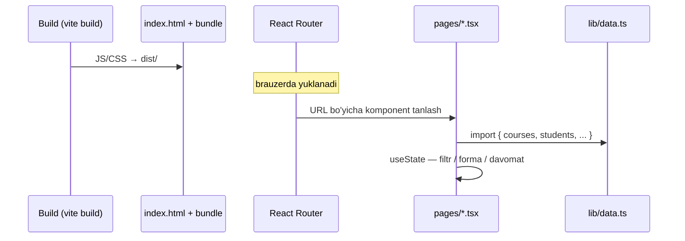
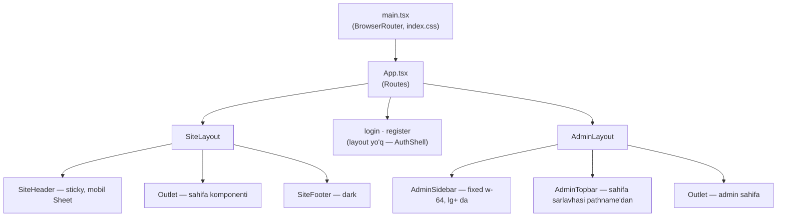

# O'quv Markaz — Loyiha arxitekturasi

Ushbu hujjat loyihaning texnik arxitekturasini to'liq tavsiflaydi: qatlamlar, routing tuzilmasi, komponentlar iyerarxiyasi, ma'lumotlar oqimi va kengaytirish yo'llari.

---

## 1. Umumiy ko'rinish

Loyiha — **React 19 + TypeScript + Vite** asosidagi **SPA** (Single Page Application) bo'lib, uchta mustaqil zonadan iborat:

| Zona | Yo'l | Layout | Maqsad |
| --- | --- | --- | --- |
| **Public sayt** | `/`, `/kurslar`, `/blog`, ... | `SiteLayout` — header + footer | Marketing, kurslar katalogi, blog |
| **Auth** | `/login`, `/register` | Layout'siz, `AuthShell` komponenti | Kirish / ro'yxatdan o'tish |
| **Admin panel** | `/admin/**` | `AdminLayout` — sidebar + topbar | Talabalar, guruhlar, jadval, davomat boshqaruvi |



---

## 2. Texnologiyalar to'plami

| Qatlam | Texnologiya | Izoh |
| --- | --- | --- |
| Bundler | Vite 6 | Dev server, HMR, production build → `dist/` |
| UI kutubxona | React 19 | Barcha sahifalar client-side render |
| Routing | React Router 7 | `BrowserRouter`, nested `Route`, `Outlet` |
| Til | TypeScript (strict) | Barcha modellar tipi `lib/data.ts` da |
| Stil | Tailwind CSS v4 | `@theme` + CSS o'zgaruvchilar, dizayn-tokenlar `index.css` da |
| Komponentlar | shadcn/ui (radix) | `components/ui/` — 17 ta primitiv |
| Ikonkalar | lucide-react | Brend ikonkalar inline SVG (footer) |
| Rasmlar | `` | `images.unsplash.com`, `i.pravatar.cc` |

---

## 3. Papkalar tuzilmasi

```
/
├── index.html                    # SPA kirish nuqtasi, meta teglar, Inter font
├── vite.config.ts                # Vite konfiguratsiya, @ alias
├── postcss.config.mjs            # Tailwind v4 PostCSS plagini
│
└── src/
    ├── main.tsx                  # ReactDOM.createRoot, BrowserRouter
    ├── App.tsx                   # ★ barcha routelar shu yerda
    ├── index.css                 # Dizayn-tokenlar: ranglar (oklch), radius, dark mode
    ├── vite-env.d.ts
    │
    ├── layouts/                  # LAYOUT QATLAMI
    │   ├── site-layout.tsx       # SiteHeader + <Outlet> + SiteFooter
    │   └── admin-layout.tsx      # AdminSidebar + AdminTopbar + <Outlet>
    │
    ├── pages/                    # ROUTING QATLAMI — har bir route = bitta sahifa
    │   ├── home-page.tsx         # /
    │   ├── faq-accordion.tsx     # bosh sahifaga xos komponent
    │   ├── kurslar-page.tsx      # /kurslar
    │   ├── kurslar-detail-page.tsx   # /kurslar/:slug
    │   ├── oqituvchilar-page.tsx
    │   ├── teachers-explorer.tsx     # qidiruv/filtr
    │   ├── blog-page.tsx
    │   ├── blog-detail-page.tsx      # /blog/:slug
    │   ├── aloqa-page.tsx
    │   ├── contact-form.tsx
    │   ├── biz-haqimizda-page.tsx
    │   ├── login-page.tsx
    │   ├── register-page.tsx
    │   ├── not-found-page.tsx    # /404 va *
    │   └── admin/
    │       ├── dashboard-page.tsx        # /admin
    │       ├── talabalar-page.tsx
    │       ├── students-table.tsx        # filtr/qidiruv jadvali
    │       ├── talaba-detail-page.tsx    # /admin/talabalar/:id
    │       ├── guruhlar-page.tsx
    │       ├── guruh-detail-page.tsx     # /admin/guruhlar/:id
    │       ├── guruh-yangi-page.tsx      # /admin/guruhlar/yangi
    │       ├── jadval-page.tsx
    │       ├── davomat-page.tsx
    │       └── oqituvchilar-page.tsx
    │
    ├── components/               # PREZENTATSIYA QATLAMI
    │   ├── ui/                   # shadcn/ui primitivlari
    │   │   └── button, card, input, table, tabs, select, sheet, ...
    │   ├── site/
    │   │   ├── logo.tsx
    │   │   ├── site-header.tsx   # sticky nav + mobil Sheet menyu
    │   │   ├── site-footer.tsx
    │   │   ├── course-card.tsx
    │   │   ├── teacher-card.tsx
    │   │   └── courses-explorer.tsx
    │   ├── admin/
    │   │   ├── admin-sidebar.tsx # adminNav konfiguratsiyasi
    │   │   └── admin-topbar.tsx  # sahifa sarlavhasi pathname'dan
    │   └── auth/
    │       ├── auth-shell.tsx
    │       └── social-auth.tsx
    │
    └── lib/                      # MA'LUMOT QATLAMI
        ├── data.ts               # ★ yagona ma'lumot manbai (mock API)
        └── utils.ts              # cn() — Tailwind class merge
```

---

## 4. Qatlamli arxitektura



**Qoidalar (dependency rule):**

1. `pages/` → `layouts/` → `components/` → `lib/` yo'nalishida import qilinadi, teskari emas.
2. `components/ui/` hech narsadan (faqat `lib/utils`) bog'liq emas — sof primitivlar.
3. Sahifaga xos komponentlar (`students-table.tsx`, `contact-form.tsx`) `pages/` ichida saqlanadi; ikki va undan ortiq joyda ishlatiladiganlar `components/` ga ko'chiriladi.
4. Mock ma'lumotlar **faqat** `lib/data.ts` orqali olinadi — sahifalarda hardcode qilinmaydi.
5. Routelar markazlashtirilgan: yangi sahifa = `pages/` da komponent + `App.tsx` ga bitta `Route`.

---

## 5. Ma'lumot qatlami (`lib/data.ts`)

Barcha domen modellari va mock ma'lumotlar bitta modulda. Bu real backend'ga o'tishda yagona almashtirish nuqtasi (single point of replacement) bo'lib xizmat qiladi.

```mermaid
erDiagram
    COURSE ||--o{ GROUP : "courseSlug"
    TEACHER ||--o{ COURSE : "teacherId"
    TEACHER ||--o{ GROUP : "teacherId"
    GROUP ||--o{ STUDENT : "groupId"
    GROUP ||--o{ LESSON : "groupName"
    STUDENT ||--o{ ATTENDANCE_ENTRY : "studentId"
    TEACHER ||--o{ BLOG_POST : "author"

    COURSE { string slug PK; string title; Category category; number price; string teacherId FK }
    TEACHER { string id PK; string name; string role; Category category; number rating }
    GROUP { string id PK; string name; string courseSlug FK; string teacherId FK; GroupStatus status }
    STUDENT { string id PK; string code; string name; string groupId FK; PaymentStatus payment }
    LESSON { string id PK; number day; string start; string groupName FK; string color }
    ATTENDANCE_ENTRY { string studentId FK; AttendanceStatus status; string note }
    BLOG_POST { string slug PK; string title; string author; ContentSection[] content }
```

**Eksport qilinadigan yordamchilar:** `formatPrice()`, `getTeacher(id)`, `getCourse(slug)`, `getInitials(name)`, `categoryColors` (kategoriya → Tailwind klass xaritasi).

---

## 6. Routing va render strategiyasi

Loyiha **to'liq client-side SPA**. Build vaqtida faqat bitta `index.html` + JS/CSS bundle yig'iladi; sahifalar brauzerda React Router orqali almashtiriladi.

| Xususiyat | Qayerda | Misol |
| --- | --- | --- |
| **Nested layout** | `SiteLayout`, `AdminLayout` | Public va admin zonalar `<Outlet />` orqali |
| **Dinamik route** | `useParams()` | `/kurslar/:slug`, `/blog/:slug`, `/admin/talabalar/:id` |
| **404** | `NotFoundPage` | `<Navigate to="/404" />` yoki `path="*"` |
| **Lokal holat** | `useState` | Filtr, forma, davomat toggle |
| **Navigatsiya** | `useNavigate()`, `<Link to>` | Login → `/admin`, kartochkalar orasida o'tish |



**Dinamik parametrlar:** `const { slug } = useParams()` — parametr topilmasa `<Navigate to="/404" replace />`.

**Route ro'yxati (`App.tsx`):**

| Path | Komponent | Layout |
| --- | --- | --- |
| `/` | `HomePage` | SiteLayout |
| `/kurslar` | `CoursesPage` | SiteLayout |
| `/kurslar/:slug` | `CourseDetailPage` | SiteLayout |
| `/oqituvchilar` | `TeachersPage` | SiteLayout |
| `/blog` | `BlogPage` | SiteLayout |
| `/blog/:slug` | `BlogPostPage` | SiteLayout |
| `/aloqa` | `ContactPage` | SiteLayout |
| `/biz-haqimizda` | `AboutPage` | SiteLayout |
| `/login` | `LoginPage` | — |
| `/register` | `RegisterPage` | — |
| `/admin` | `DashboardPage` | AdminLayout |
| `/admin/talabalar` | `TalabalarPage` | AdminLayout |
| `/admin/talabalar/:id` | `StudentProfilePage` | AdminLayout |
| `/admin/guruhlar` | `GuruhlarPage` | AdminLayout |
| `/admin/guruhlar/yangi` | `YangiGuruhPage` | AdminLayout |
| `/admin/guruhlar/:id` | `GuruhDetailPage` | AdminLayout |
| `/admin/jadval` | `JadvalPage` | AdminLayout |
| `/admin/davomat` | `DavomatPage` | AdminLayout |
| `/admin/oqituvchilar` | `OqituvchilarPage` | AdminLayout |
| `*` | `NotFoundPage` | — |

---

## 7. Navigatsiya va layout iyerarxiyasi



- Admin nav konfiguratsiyasi bitta joyda: `admin-sidebar.tsx` dagi `adminNav` massivi. Yangi bo'lim qo'shish = massivga bitta yozuv + `App.tsx` ga `Route` + `pages/admin/` da sahifa.
- Topbar sarlavhasi `useLocation().pathname` orqali `adminNav` dan avtomatik aniqlanadi (`usePageTitle()`).
- Aktiv havola: `pathname.startsWith(href)` (`/admin` uchun aniq tenglik).
- Ichki havolalar: React Router `<Link to="...">` (Next.js `href` emas).

---

## 8. Dizayn tizimi

- **Tokenlar** `index.css` da oklch formatida: `--primary` (ko'k, ≈`#2563eb`), `--radius: 0.625rem`, sidebar tokenlari, dark mode `.dark` klassi orqali tayyor.
- **Shrift:** Inter — `index.html` orqali Google Fonts, `--font-sans` CSS o'zgaruvchisi.
- **Konvensiyalar:**
  - Kartalar: `rounded-xl border shadow-sm` (public), `shadow-xs` (admin, slate-50 fonda oq kartalar)
  - Konteynerlar: `max-w-7xl mx-auto px-4 sm:px-6 lg:px-8`, seksiyalar `py-16/20`
  - Status badge'lar: yumshoq ranglar — `bg-emerald-50 text-emerald-700` (To'langan/Faol), `bg-red-50 text-red-700` (Qarzdor), `bg-orange-50 text-orange-700` (Kutilmoqda)
  - Jadval sarlavhalari: `text-xs uppercase text-muted-foreground`
- **Responsivlik:** mobile-first; jadvallar `overflow-x-auto`, sidebar/menyu mobilda `Sheet`, gridlar `sm:grid-cols-2 lg:grid-cols-3/4` bo'yicha yig'iladi.

---

## 9. Build va ishga tushirish

| Buyruq | Vazifa |
| --- | --- |
| `npm run dev` | Vite dev server (HMR) |
| `npm run build` | `tsc -b` + production bundle → `dist/` |
| `npm run preview` | `dist/` ni lokal serverda ko'rish |
| `npm run lint` | ESLint tekshiruvi |

Production deploy: `dist/` papkasini statik hostingga (Nginx, Netlify, Vercel static) yuklash. SPA uchun barcha yo'llar `index.html` ga qaytarilishi kerak (fallback).

---

## 10. Kengaytirish yo'li (real backend'ga o'tish)

1. **API qatlami:** `lib/data.ts` dagi massivlarni `lib/api/*.ts` funksiyalariga almashtirish (`getCourses()`, `getStudent(id)` ...). Tiplar o'z joyida qoladi.
2. **Ma'lumot olish:** sahifalar `useEffect` + `fetch` yoki **TanStack Query** (`useQuery`) orqali API dan yuklaydi; hozirgi mock importlar o'rniga.
3. **Mutatsiyalar** (davomat saqlash, guruh yaratish, formalar) — REST/GraphQL API endpointlariga `fetch` yoki `useMutation`.
4. **Autentifikatsiya:** React Router `loader` yoki wrapper komponent (`ProtectedRoute`) bilan `/admin` ni himoyalash; JWT/session tekshiruvi; hozircha login shunchaki `navigate("/admin")` qiladi.
5. **Holat boshqaruvi:** hozirgi `useState` yetarli; server bilan sinxron kerak bo'lganda TanStack Query qo'shish tavsiya etiladi.
6. **Code splitting:** katta bundle hajmi uchun `React.lazy()` + `Suspense` yoki route-based dynamic import (`import()`) qo'llash mumkin.
